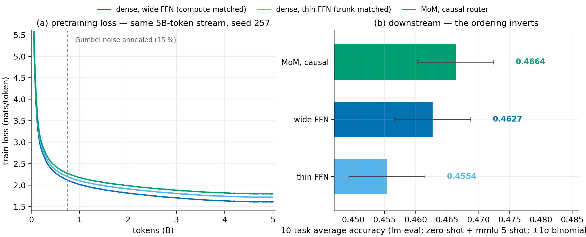
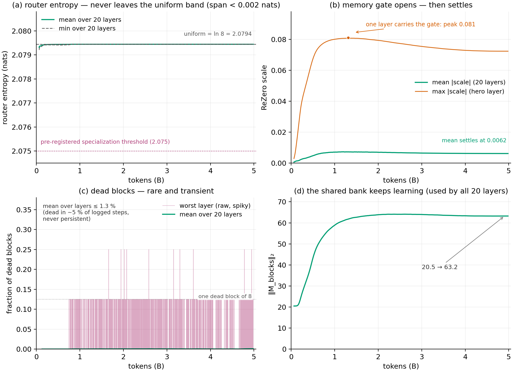

# The Naylis methodology — how the results were produced, verified, and reported

The numbers in [README.md](README.md) are only worth as much as the protocol
behind them. This document is that protocol: the leak that started the project,
the four-arm design, the predictions registered before the data, the bit-exact
checks, the statistics, the platform disclosure, and the corrections made along
the way. It exists so that every claim can be audited back to a decision.

---

## The leak, and why this repo exists

The first pretraining run of this design used a router that averaged hidden
states over the *whole* sequence — `h = mean(x_0..x_S)`. That silently leaked
future tokens into the routing decision: the router saw, at training time, the
very continuation the model was being asked to predict. The architecture looked
fine; the evaluation was not.

Worse, the leak was structural on both sides:

- **Training**: a per-sequence router score is computed once over the full
  sequence, so every routing decision is conditioned on tokens the model has
  not emitted yet.
- **Evaluation**: loglikelihood scoring re-feeds whole sequences, so a
  per-sequence router still peeks at continuations at benchmark time — the
  leaky arm is favored by the measurement itself, not just by its training.

This repo carries the corrected, **causal** router (`h_t = mean(x_0..x_t)`,
fp32 cumsum, bit-verified) and the ablation that answers the question honestly:
*does a memory bank still pay when its router can only look backwards?*

## The four-arm design

Four arms, one variable at a time. All runs: seed 257, the same 5B-token
Cosmopedia-V2 stream (one epoch, same order), the same HF Trainer schedule
(lr 3e-4, cosine, 5% warmup, 32,768 tokens/step, ~152k steps), the same
tokenizer and data pipeline.

| arm | what it varies | what it isolates |
|---|---|---|
| dense, wide FFN (299.4M) | FFN width 2688 | compute-matched control: does plain dense compute do the same job? |
| dense, thin FFN (197.2M) | FFN width 1024 | trunk-matched control: the MoM arm's exact trunk, memory removed |
| MoM, leaky router (282.8M) | the original router | the leak, kept as the ablation baseline |
| **MoM, causal router (282.8M)** | the router's causality | **the A/B that matters** |

- **The A/B that matters** — causal vs leaky: identical architecture,
  identical everything, except the router's prefix mean stops at the current
  token. Any difference between the two arms is attributable to the leak and
  nothing else.
- **The two dense controls bracket the MoM arm**: the thin control shares its
  exact trunk (isolates what the memory subsystem adds); the wide control
  absorbs its compute in FFN width (tests whether dense compute substitutes).

Arm naming honesty: the project originally labelled the two dense controls
"iso-FLOP" and "iso-param". Exact MAC counting showed the true relation — the
MoM arm costs ≈ +58% per-token compute over its thin trunk and ≈ 7% under the
wide control — so the labels became *compute-matched* and *trunk-matched*. See
[Corrections log](#corrections-log).

## Pre-registered predictions

Predictions were written before the benchmark data was unblinded:

1. **"Strong signal" case** — the causal arm beats the leaky arm *despite* the
   protocol's structural bias favoring the leaky router (training-time leak
   plus evaluation-time leak).
2. **Cold expectation** — no net domination over the wide dense control at
   this scale.

During training, a decision rule was pre-registered at mid-run: if mean router
entropy dropped below **2.075** before 50k steps, the causal fix had cracked
the uniform distribution and specialization was underway; otherwise the fix
alone was insufficient to induce specialization.

**How they resolved.** Both benchmark predictions fell as pre-registered: the
causal arm beat the leaky arm (the strong case) and did not dominate the wide
control (the cold case). The entropy rule resolved to its second branch:
router entropy stayed at 2.079 ≈ ln 8 from start to finish — no
specialization. Recorded as-is, not retro-fitted.

## Bit-exact verification before any GPU run

The router's math is verified bit-exactly on CPU before any GPU run — the
checks live in `tests/test_parity.py` (36 checks) and `mom_kernels/probe.py`
(8/8 preflight):

- the LM gradient through the MoM region is **exactly zero** while
  `ReZero scale = 0` — the lock is watertight;
- the router gradient is exactly proportional to `scale`;
- the cumsum prefix-mean read is **bit-identical** to a naive reference;
- the load-balancing aux at uniform distribution is exactly `2.000000`;
- the bank receives gradient as soon as `scale > 0`;
- the aux pressure reaches the router.

The same discipline extends to the kernels: the XLA chunked path is proven
bitwise-equal to eager; the Pallas path is validated against a fp32 oracle in
CPU simulation (bf16 error 5–8e-3, fp32 ~1e-7); the Triton path is opt-in and
requires its GPU parity sections to pass before any A/B.

## Benchmark protocol

*The figure shows the three models carried in the README (dense controls +
causal); the leaky arm appears only in the statistics below.*

Ten tasks via [lm-eval](https://github.com/EleutherAI/lm-evaluation-harness),
full splits, zero-shot except mmlu (5-shot); `acc_norm` for multiple-choice
tasks, `acc` otherwise; fp16, batch 8. Per-task sample sizes (full splits):
hellaswag 10,042 · arc_easy 2,376 · arc_challenge 1,172 · piqa 1,838 ·
boolq 3,270 · copa 100 · winogrande 1,267 · sciq 1,000 · openbookqa 500 ·
mmlu 14,042 — every reader can recompute the binomial noise behind the
z-scores below. Raw ledger:
[`docs/bench/benchmark_results.json`](docs/bench/benchmark_results.json).

Significance: conservative **unpaired z on binomial noise** per task, pooled
per arm (σ² = Σ p(1−p)/n / 100²), |z| ≥ 2 read as real. This ignores
paired-task covariance, i.e. it is if anything too strict.

Reading the table honestly:

- **causal − thin: +1.10 pts, z = +2.0** — at the same trunk, the memory
  subsystem and its compute pay downstream (boolq +3.8 at z = +3.0, sciq +5.9
  at z = +2.6).
- **causal − vanilla: +0.37 pts, z = +0.4 (ns)** — no net domination over wide
  dense compute. The pre-registered cold case.
- **causal − leaky: +0.22 pts, z = +0.9 (ns)** overall, **+0.92 pts excluding
  copa** — the honest router beats the cheater against the protocol's bias.
- **The cheater's edge is a copa artifact**: copa has n = 100; the leaky arm's
  +6 pts there is six items. Exclude it and the leaky arm falls *below* the
  wide dense control (−0.50 pts, z = −0.5) while losing hellaswag to it for
  real (−2.26 pts, z = −3.2).
- Task-level real effects for the causal arm: sciq +6.3 (z = +2.8), boolq +3.8
  vs thin (z = +3.0), mmlu +1.2 (z = +2.1 — but all arms sit in the 24–26%
  band around the 25% chance floor, so this is half a signal), hellaswag −1.9
  (z = −2.7).

## Platform disclosure

Disclosed, not hidden: the three ablation arms trained on **A10G in bf16**;
the causal arm on **2×T4 in fp16 AMP with GradScaler** (Turing has no bf16
tensor cores; measured throughput 10,251 tokens/s sustained at 15.6% MFU —
one 5B-token epoch in ≈135 wall-clock hours across resumed segments,
comparable to the thin-FFN control's training time), and it stopped 0.2% short
of the full epoch (4.98B vs 4.99B tokens, learning rate already at ~5e-9). Cross-platform anchors were
re-checked at matching steps before comparing; the router's cumsum is fp32 in
both regimes. The leak-controlled A/B (causal vs leaky) is same-seed,
same-data, same-schedule; the precision stack is the one honest confound left,
and it is disclosed here rather than papered over.

## The honest reading

The causal arm wins **without any demonstrated block specialization**: router
entropy stays flat at ln 8 ≈ 2.0794, never approaching the pre-registered
2.075 threshold. The routing layer remains effectively uniform; one "hero"
layer carries the memory gate (peak |scale| 0.081, mean across layers 0.0062);
dead blocks are rare and transient (mean over layers ≤ 1.3%, never
persistent). The win therefore comes from *under* the routing layer — added
capacity (a bank that learns throughout training, ‖M‖₂ 20.5 → 63.2) and
error-splitting across 20 residual reads — not from clever routing. The
signature matches that reading: recall-style tasks rise (sciq, boolq,
arc_easy, winogrande), pure fluency dips (hellaswag).

Train losses are reported as **windowed means over the last 1,000 logged
steps** (vanilla 1.610 / thin 1.718 / leaky 1.758 / causal 1.798), not as
single noisy points — the raw last-point values are 1.605/1.714/1.755/1.776,
and the windowed "tax of honesty" on the causal arm is 0.041 nats.

What is claimed, at 300M params / 5B tokens, single seed:

1. A memory bank read through a strictly causal router **matches the leaky
   router it replaced**, then edges past it — with the leak's train-time
   advantage removed.
2. Against its own trunk, the memory subsystem **pays** (+1.10 pts, z = 2.0).
3. Against wide dense compute, it **holds its ground** (ns) despite 8% less
   compute and 6% fewer parameters.

What is **not** claimed: no routing specialization, no MMLU signal, one scale,
one seed, and a train loss that still clearly favors dense FFNs.

## Corrections log

Transparency obligations incurred during the project, all resolved:

- **"iso-FLOP / iso-param" → compute-matched / trunk-matched.** Exact per-token
  MAC counting per layer showed MoM ≈ 11.54M, thin ≈ 7.34M (+58%), wide ≈
  12.45M (MoM = −7.3%). The original labels overstated the match; every label
  in the repo was replaced with the measured ratios. The correction is
  *conservative* for the MoM claim: it makes the wide control stronger than
  advertised.
- **Scaling arithmetic ×10.** The roadmap's "3–4 days on v5e-8" was wrong:
  6ND×3 arms ≈ 2×10²¹ FLOPs ≈ 40 days on v5e-8 at 40% MFU (method anchored
  against Llama-3 8B: reproduces ~32 real days), ~10 days on v5e-32, ~3 days
  on v5e-128. Corrected everywhere, including this document.
- **Platform confound disclosed** (above) rather than averaged away.
- **BinDataset stride.** The `(seq_len+1)` row stride with internal-shift
  labels served 1024 of every 1025 tokens (~0.1% of the stream never read);
  fixed to a `seq_len` stride. Published checkpoints and evals are
  unaffected — they trained and scored on the stream as then served; future
  runs read the full stream.
- **Redundant `post_init`.** Model construction ran five init passes — the
  standard `super()` trees, then the Naylis tree drawn twice. The duplicate
  Naylis pass was removed (the standard HF double-construction is left
  untouched). Build-time only: fresh-run init draws shift, published
  checkpoints unaffected.
- **Eval provenance.** The benchmark ledger, reconstructed from the Colab
  log, had no harness version captured; `lm_eval_version` is now recorded
  as `0.4.13` (last stable PyPI release at the run date) and pinned in
  `requirements.txt` so re-runs match.

## Roadmap: 1B params, 100B tokens

The 300M evidence says "capacity, not routing" — so the next run must make
capacity the variable. Plan: three arms (wide dense, thin dense, MoM causal),
same seed / same stream / same protocol, 1B params, 100B tokens
(`bench_500m.toml` and `bench_fp8_100m.toml` are the first steps of that
ladder). Decision metrics pre-registered before launch, as above; the hard
part is the 100B-token data pipeline, not the compute.
