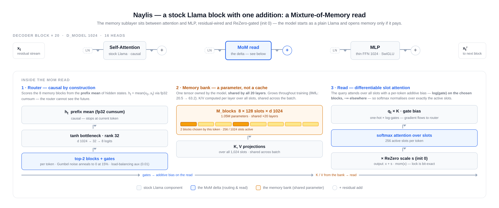

# Naylis: a Llama with a routed memory bank

Naylis extends a stock Llama backbone with a **Mixture-of-Memory (MoM) layer**: a
*learnable, model-level* bank of memory slots, read sparsely through a
low-rank **causal** router. The single architectural delta sits between attention
and MLP of every decoder block; everything else is stock Llama, trained with
stock tooling.

Trained at 300M parameters on a deliberately short 5B-token budget — one epoch,
~152k steps — against two dense controls (a compute-matched wide FFN and a
trunk-matched thin FFN), the causal MoM model posts the best 10-task benchmark
average of the three (46.64) despite the worst pretraining loss (1.798): train
loss and downstream usefulness invert. Absolute numbers at this budget are small
by design; the signal is the arm-vs-arm delta — and that delta is bought at
thin-FFN-like training time, in a 16 GB envelope (see
[Results](#results) and [What Naylis buys you](#what-naylis-buys-you)).

Checkpoints & training curves: [naylis_mom_fixed](https://huggingface.co/datasets/TheRealSkyline/naylis_mom_fixed) ·
[baseline checkpoints](https://huggingface.co/datasets/TheRealSkyline/naylis_ablation_300M)

> **How these numbers were produced and verified** — the controls, the
> pre-registered predictions, the bit-exact router checks, the platform
> disclosure — is documented in [METHODOLOGY.md](METHODOLOGY.md).

<p align="center">
  
</p>

## Why Naylis?

Transformers already carry memory — but as *ephemeral caches*: attention keys a
running cache of past activations; MoE experts are memory only in a routing
sense. Naylis makes memory a **first-class parameter**: one tensor, learned by
gradient descent like any weight, shared by every layer, and read sparsely by a
router that is **causal by construction** — no routing decision ever sees a
future token.

- **Memory as a parameter, not a cache** — `M_blocks`: in the reference config,
  8 blocks × 128 slots × d 1024 = 1.05M parameters, owned once by the model and
  shared by all 20 layers (the shape is a config knob — `mem_size`,
  `block_size` — not a law of the architecture). It grows throughout training
  (‖M‖₂: 20.5 → 63.2, see [router dynamics](img/router_dynamics.png)).
- **A router that cannot see the future** — each token scores the blocks from
  the *causal prefix mean* `h_t = mean(x_0..x_t)`, computed in fp32 by
  cumsum. Strict causality at the routing level, bit-verified.
- **A differentiable sparse read** — top-2 blocks per token, expressed as an
  additive bias of `one-hot × log(gates)` on the slot attention: the softmax
  normalises over exactly the active slots, and the LM gradient flows to
  the router through the gates.
- **ReZero-gated (init 0)** — the whole sublayer starts at zero output, so
  the model begins life as a plain Llama and opens the memory only if it pays.
- **Three kernel backends behind one door** — eager SDPA (the trusted
  reference), XLA chunked (bitwise parity, bias memory ÷4), plus Pallas/TPU and
  Triton/CUDA flash-read paths. Same maths, auditable against the same
  reference.

## The Mixture-of-Memory layer

Every decoder block keeps stock causal self-attention and MLP, and adds the
memory read between the two, residual-wired:

```
x = x + attn(input_layernorm(x))           # stock Llama self-attention
x = x + mom(mom_norm(x))                   # <- the delta: read the memory bank
x = x + mlp(post_attention_layernorm(x))   # stock Llama MLP
```

**The bank.** `M_blocks` is a single tensor of `num_blocks × block_size × d`
(8 × 128 × 1024 = 1.05M parameters in the reference config — every term is a
`[mom]` knob). It is *not* a cache of past activations — nothing is written to
it at inference time. It is a weight like any other, updated by the optimiser,
and it is shared by all 20 layers: one global, model-level memory rather than
20 private ones.

**The router (causal by construction).** Each token scores the blocks from
the *causal prefix mean* of its hidden states:

```
h_t = (1 / (t+1)) Σ_{i≤t} x_i          # fp32 cumsum — stops at the current token
logits = W_up · tanh(W_down · h_t)      # rank-32 bottleneck (router_rank), 1024 → 32 → 8
top-2 blocks + gates                    # per token (top_blocks = 2)
```

Gumbel noise on the logits anneals to zero at 15% of the training horizon; a
load-balancing auxiliary loss (weight 0.01) keeps all blocks alive. The fp32
cumsum is non-negotiable: it is what makes causality *bit-exact* rather than
approximate.

**The read.** K/V projections are computed once per layer over *all* bank slots
and shared across the batch; the query stream attends over all 1,024 slots with
a per-token additive bias — `log(gate)` on the chosen blocks, a hard mask
elsewhere — so the softmax normalises over exactly the `top_blocks ×
block_size` active slots of each token. The bias is differentiable end-to-end
(one-hot × log-gates), so the LM gradient reaches the router through the gates.
A ReZero scale (init 0) gates the whole sublayer.

**The cost.** The MoM attention spans `mem_size` slots instead of a gathered
subset: ≈ +58% per-token compute over the thin trunk, ≈ 8% under the wide
dense control (exact MAC count). That is the price of strict per-token
causality without a per-token gather — and in wall-clock terms it stayed
modest: the reference run sustained **10,251 tokens/s (15.6% MFU)** on a
free-tier 2×T4 pair, one 5B-token epoch in ≈135 GPU-hours, comparable to the
thin-FFN control's training time (the read is one shallow, memory-bound
attention pass; the whole run fits a 16 GB card). Platform note in
[METHODOLOGY.md](METHODOLOGY.md#platform-disclosure).

**Numerics.** Training is bf16-only in this repo (fp32 master weights, no
GradScaler); the router's cumsum is always fp32. fp8 (Transformer Engine or
torchao) is an opt-in `[precision]` policy that never touches the routing path
(see *Kernels & precision* below).

| config | arm | FFN | params | role |
|---|---|---|---|---|
| `vanilla.toml` | dense, wide | 2688 | 299.4M | compute-matched dense control |
| `vanilla_thin.toml` | dense, thin | 1024 | 197.2M | the MoM model's exact trunk, memory removed |
| `naylisMoM.toml` | **MoM, causal router** | 1024 | 282.8M | this repo's model |

Backbone shared by all arms: d_model 1024, 20 layers, 16 heads, vocab 49,152
(tied embeddings), seq len 1024, cosmo2-tokenizer.

**All the numbers above are knobs.** The bank shape (`mem_size` 1024,
`block_size` 128 → 8 blocks), the router bottleneck (`router_rank` 32), the
routing width (`top_blocks` 2), the load-balancing weight and the
Gumbel-annealing horizon are `[mom]` fields in `naylisMoM.toml` — nothing in
the architecture depends on these particular values. The invariants are
structural: **one bank shared by every layer, a router that reads only the
causal prefix, a differentiable top-k read, a ReZero gate.** `bench_500m.toml`
and `bench_fp8_100m.toml` are the first configs on that ladder that move the
knobs.

## Results

```
3 models · same seed (257) · same 5B-token stream · same trainer · same budget
                              train loss     10-task benchmark average
dense, wide FFN               1.610  best    →  0.4627
dense, thin FFN               1.718           →  0.4554  worst
MoM, causal router (here)     1.798  worst    →  0.4664  best
```

**Read the budget before the scores.** One 5B-token epoch is a *short* train:
~18 tokens per parameter — near compute-optimal for 300M, and 20× below the
100B-token budget the roadmap targets. At this budget every absolute number is
small (mmlu sits in the chance band, hellaswag in the low 30s); these are not
deployable models but a controlled comparison at fixed cost. What the protocol
supports is the **delta between arms** — same seed, same stream, same schedule
— and the cost at which that delta is bought.

Train loss and downstream usefulness **invert**: the causal MoM model is the
worst of the three in nats/token and the best on the benchmark.


Ten tasks via lm-eval, full splits, zero-shot except mmlu (5-shot); `acc_norm`
for multiple-choice tasks, `acc` otherwise. Raw ledger:
[`docs/bench/benchmark_results.json`](docs/bench/benchmark_results.json).

| task          | dense wide | dense thin | **MoM causal** |
| ------------- | ---------: | ---------: | -------------: |
| hellaswag     |  **36.12** |      34.40 |          34.18 |
| arc_easy      |      44.65 |      43.98 |      **45.33** |
| arc_challenge |  **29.10** |      27.90 |          27.82 |
| piqa          |  **65.56** |      64.69 |          64.64 |
| boolq         |  **62.17** |      57.86 |          61.62 |
| copa          |      64.00 |      64.00 |          64.00 |
| winogrande    |      50.83 |      50.99 |      **51.85** |
| sciq          |      52.50 |      52.90 |      **58.80** |
| openbookqa    |  **33.40** |      33.00 |          32.60 |
| mmlu (5-shot) |      24.33 |  **25.70** |          25.57 |
| **average**   |     46.27  |     45.54  |      **46.64** |


Read with the significance tests (conservative unpaired z on binomial noise —
full detail in [METHODOLOGY.md](METHODOLOGY.md)):

- **MoM causal − thin: +1.10 pts, z = +2.0** — at the same trunk, the memory
  subsystem and its compute *do* pay downstream (boolq +3.8 at z = +3.0,
  sciq +5.9 at z = +2.6).
- **MoM causal − wide: +0.37 pts, z = +0.4 (ns)** — no net domination over
  wide dense compute at this scale, despite 8% less compute and 6% fewer
  parameters.

### What the win is made of


The causal MoM model wins **without any demonstrated block specialization**:
router entropy stays flat at ln 8 ≈ 2.0794 from start to finish. One "hero"
layer carries the memory gate (peak |scale| 0.081); dead blocks are rare and
transient. The win therefore comes from *under* the routing layer — added
capacity (a bank that learns throughout training) and error-splitting across
20 residual reads — not from clever routing. The signature matches: recall-style
tasks rise (sciq, boolq, arc_easy, winogrande), pure fluency dips (hellaswag).

### What Naylis buys you

The 300M result, read as an engineering proposition rather than a leaderboard
line:

- **Factual capacity that scales cheaply.** The capacity organ is one bank,
  shared by all 20 layers. Growing it costs `num_blocks × block_size × d`
  parameters *once*, and read compute that grows linearly with the slot count.
  The dense alternative — widening the FFN — costs `d_ffn × d_model`
  parameters *per layer, twenty times over*, and buys general compute rather
  than memory specifically. At 300M the entire memory subsystem (+85.6M
  parameters over its thin trunk) still leaves the model 6% smaller than the
  wide control, with 8% less per-token compute.
- **A measured recall signature, not a vibe.** The win sits exactly where a
  memory should show: sciq +5.9 and boolq +3.8 vs thin (z ≥ 2.6), arc_easy and
  winogrande up, pure fluency (hellaswag) dipping — the trade a memory layer is
  *expected* to make. The bank's norm grows 20.5 → 63.2 across the run:
  capacity that keeps filling for the whole train.
- **A bounded cost envelope.** Wall-clock stayed comparable to the thin-FFN
  control (10,251 tok/s sustained, 15.6% MFU, one 5B-token epoch in ≈135
  GPU-hours on a free-tier 2×T4 pair); the whole run fits a 16 GB card. The
  bank itself is 2 MB in bf16 — the only sizable extra activation, the
  slot-attention score map, is already chunked ÷4 by the XLA path and is the
  target of the Triton flash-read kernel. Scaling the bank up does not
  proportionally scale the bill.
- **A scaling direction with priors on it.** The closest prior art (Memory
  Layers at Scale, Berges et al. 2024) reports memory layers overtaking
  matched-compute dense FFN on factual tasks as models pass ~1B parameters.
  Naylis's 300M signature — recall up, fluency flat-to-down, routing still
  uniform — is what the low end of that curve should look like. The
  1B/100B roadmap run is the pre-registered test of exactly this.

**Claims** (300M params, 5B tokens, single seed): a strictly causal memory bank
(1) pays against its own trunk (+1.10 pts, z = 2.0), (2) holds its ground
against wide dense compute (ns) despite 8% less compute and 6% fewer
parameters, (3) does both at training time and VRAM comparable to its thin
trunk. **Non-claims**: no routing specialization, no MMLU signal, one
scale, one seed. The next scale (1B params, 100B tokens) is where the capacity
story gets decided.

## Kernels & precision

- **eager SDPA** (default): the trusted path, bit-verified — the path that
  trained the causal reference run.
- **XLA/TPU** (`mom_kernels/xla_tpu.py`): structured read, bias built per
  chunk — bitwise parity with eager, bias memory ÷4 at S = 1024.
- **Pallas/TPU** (`mom_kernels/pallas_tpu/`): causal read kernels with
  dlog-gates backprop; validated against a fp32 oracle in CPU simulation.
- **Triton/CUDA** (`mom_kernels/triton_gpu.py`, experimental, opt-in): flash
  read with online-softmax forward and atomic dq/dlog-gates backward; bias
  lives in registers. bf16 only, head_dim ≤ 128, power-of-two sizes; run its
  parity tests on your GPU before any A/B.
- **Precision policy**: bf16 training only (fp16 refused, fail-loud); fp8 is
  opt-in and never covers the router, the bank, K/V projections, the ReZero
  scale or the LM head; Transformer-Engine fp8 combined with activation
  checkpointing is refused (recompute would escape the fp8 autocast and fork
  the numerics silently).

## Getting Started

```bash
python -m venv .venv && source .venv/bin/activate
pip install -r requirements.txt          # torch, transformers, triton, jax, ...

python mom_kernels/probe.py              # MoM preflight — 8/8 must pass
python tests/test_parity.py              # 36/36 on CPU (GPU sections auto-gate)

# train (single GPU; NGPU=8 for torchrun)
export HF_TOKEN=hf_...
./run_biggpu.sh naylisMoM.toml           # probes run first, fail fast

# evaluate / benchmark checkpoints from the Hub (bf16, eager MoM path)
python evaluate.py                        # default task suite
python evaluate.py --models llama-300m    # one arm
python evaluate.py --skip-download        # use local ./model_<name> dirs
```

Default recipe: lr 3e-4, cosine, 5% warmup, 32,768 tokens/step, ~152k steps =
one 5B-token epoch, seq len 1024, bf16 autocast, seed 257. The eager SDPA path
is the default and the parity reference; `use_kernel = true` arms the kernel
backends.

## Repository layout

```
model.py              NaylisLlamaForCausalLM — the MoM layer, causal router, read
pretrain.py           HF Trainer loop, probes, resume, curve upload
evaluate.py           checkpoint loading (incl. legacy key remap + MoM shape derivation)
naylis_precision.py   bf16 / fp8 (TE, torchao) policy, routing-path exclusions
probe_fp8.py          fp8 availability probe
mom_kernels/
  reference.py        numpy/torch reference of the causal read
  xla_tpu.py          XLA fused-shape path (chunked bias, ÷4 memory)
  pallas_tpu/         Pallas kernels (validated in CPU simulation)
  triton_gpu.py       experimental Triton flash read (CUDA, bf16)
  probe.py            preflight: parity + causality bit-exact (8/8)
tests/test_parity.py  36 checks: parity, causality, kernels, precision, legacy ckpt
*.toml                the model + control configs, forward-looking bench configs
run_biggpu.sh         fail-fast launcher (probes must be green first)
img/                  figures used by this README and METHODOLOGY.md
architecture.html     editable source of the block diagram (img/architecture.png)
docs/bench/           benchmark ledger (raw JSON)
METHODOLOGY.md        how the results were produced and verified
```

## Checkpoints, curves, data

- Naylis causal reference run: `TheRealSkyline/naylis_mom_fixed` —
  `naylis_mom_causal_seed257/` (`model_final/`, `checkpoint/`, `curves/`).
- Dense controls (wide / thin) and full trainer states:
  `TheRealSkyline/naylis_ablation_300M` (HF dataset).
- Training stream: `TheRealSkyline/5B_Tokens_Cosmopedia-V2`
  (`pretrain_data_5B.bin`, one epoch).
- Tokenizer: `HuggingFaceTB/cosmo2-tokenizer` (49,152 vocab).

The figures in this repo are rebuilt from those trainer states (token axis,
smoothing, annotations); the raw per-step curves are on the HF repos.

## Roadmap — 1B params on 100B tokens

The 300M evidence says "capacity, not routing" — so the next run must make
capacity the variable. Plan: three arms (wide dense, thin dense, MoM causal),
same seed / same stream / same protocol, 1B params, 100B tokens
(`bench_500m.toml` and `bench_fp8_100m.toml` are the first steps of that
ladder).

## License & citation

MIT — © 2026 Silyan Larak. If this repo is useful to you:

```bibtex
@misc{larak2026naylis,
  title  = {Naylis: a Llama with a routed memory bank and a causal router},
  author = {Larak, Silyan},
  year   = {2026},
  url    = {https://github.com/<you>/naylis},
  note   = {300M params, 5B tokens, causal routed memory bank}
}
```
